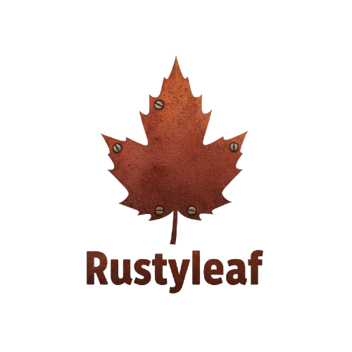

<p align="center">
  
</p>

<h1 align="center">Rustyleaf</h1>

<p align="center">
  <strong>A Leaflet-style map API with a Rust + WebAssembly + WebGL2 rendering core.</strong><br>
  Built for one thing: keeping the familiar Leaflet developer experience while rendering datasets that make DOM-based maps fall over.
</p>

<p align="center">
  <a href="https://www.npmjs.com/package/rustyleaf"></a>
  <a href="LICENSE"></a>
  
  
</p>

<p align="center">
  <a href="https://github.com/mehdilhy/rustyleaf/actions"></a>
  
  
  
  
</p>

<p align="center">
  
  
  
  
  
  
</p>

> ⚠️ **Pre-alpha (v0.0.2).** The API will change without notice and this is not production-ready. It is, however, honestly documented: everything listed below works today and is covered by unit and end-to-end tests.

---

## Why Rustyleaf?

Leaflet's API is beloved, but its DOM/Canvas renderer struggles past a few thousand features. WebGL map engines (MapLibre GL, deck.gl) scale, but with a different mental model. Rustyleaf is an experiment in having both:

- **Leaflet-shaped API** — `new Map('map')`, `layer.addTo(map)`, `map.on('click', ...)`.
- **Rust/WASM core** — GeoJSON parsing, polygon tessellation (Lyon), and R-tree spatial indexing run in compiled Rust, not the JS main thread.
- **WebGL2 rendering** — tiles, points, lines, and polygons drawn on the GPU; GeoJSON geometry is triangulated once, cached in GPU buffers, and reused across frames.

**Performance:** point rendering is GPU-resident (upload once, project in the
vertex shader), so it holds **60fps at 1,000,000 points** in the
[reproducible benchmark](benchmark/). Against Leaflet's canvas renderer that's
~3× faster at 100k and ~37× at 1M; against MapLibre GL it ties on render FPS
while setting up ~3× faster and still rendering at 1M points (where MapLibre ran
out of memory in the test environment). Numbers are hardware-specific — run the
benchmark yourself. This measures point-rendering throughput only, not features
or ecosystem, where Leaflet and MapLibre are far more mature.

Point layers also cap total per-frame fragment work: zoomed far enough out
that a layer's on-screen footprint collapses (e.g. panning a 1M-point dataset
out to a world view), only a bounded, deterministically-shuffled sample of
the *unmodified* vertex buffer is drawn — a fair subset, not a truncation —
so overlapping blended points can't serialize the GPU into single digits of
fps. At full-viewport coverage the budget exceeds the point count and every
point draws.

Raster tile layers wrap horizontally at the antimeridian (the world repeats,
Leaflet-style) instead of showing empty gray past ±180°.

## What works today

- XYZ raster tiles (OpenStreetMap-compatible URL templates, subdomain rotation, tile cache with eviction), **WMS layers** (`WMSTileLayer`, per-tile EPSG:3857 bbox computed in the Rust core), and a programmable **`GridLayer`** (DOM tiles via `createTile`)
- Point, line, and polygon layers with per-feature color/size/metadata; **line width is honored** (segments are expanded into screen-space quads on the GPU)
- **Markers rendered on the GPU** — `Marker` with `Icon` / `DivIcon`, popups & tooltips, draggable flag, opacity/z-index, Leaflet-style events (`click`, `mouseover`, `mouseout`, `dragstart`/`drag`/`dragend`). Plain `Icon` markers are drawn as GPU sprites inside the Rust/WASM core (not DOM overlays), so they scale like the rest of rustyleaf's layers; `DivIcon` markers render custom HTML as tracked DOM overlays. Bitmap icons (`iconUrl` on `Icon`) are not rendered yet.
- GeoJSON layer: load from object, string, URL, `File`, or streamed chunks; styling options; GPU-cached geometry; Leaflet-style `filter` / `pointToLayer` / `onEachFeature` (with per-feature popups and click/hover handlers)
- Pan, scroll-zoom, momentum ("kinetic") dragging, **box zoom** (shift-drag), **keyboard navigation** (arrows pan, +/- zoom), and **touch gestures** (one-finger pan with momentum, two-finger pinch zoom, double-tap zoom, long-press for the context menu)
- Click / hover hit-testing via an R-tree spatial index (rebuilt only when data changes)
- Leaflet-style events: `move(start/end)`, `zoom(start/end)`, `click`/`hover` (with hit-tested `feature` payloads), `dragstart`/`drag`/`dragend`, `layeradd`/`layerremove`, `popupopen/close`, `tooltipopen/close`, `boxzoomend`, `resize`, `load`, `locationfound`/`locationerror`, plus raw `mousedown`/`mouseup`/`contextmenu`/`keydown`/`keyup`
- HTML popups with auto-pan, plus lightweight **Tooltip** overlays (bound to markers/layers)
- **Vector shapes** — `Circle` (geodesic radius in meters), `CircleMarker` (pixel radius, drawn as a GPU point), `Rectangle` (from bounds)
- **Layer grouping** — `LayerGroup` (bulk add/remove) and `FeatureGroup` (union `getBounds`, events delegated to children); `map.addLayer/removeLayer/hasLayer`
- **Ground overlays** — `ImageOverlay`, `VideoOverlay`, `SVGOverlay` pinned to bounds and repositioned every frame
- **Plugin surface** — `Handler` base class with `map.addHandler(name, HandlerClass)`, plus `Util` helpers (`stamp`, `template`, `throttle`, `wrapNum`, ...)
- **UI controls** — `Control` base with `ZoomControl` (zoom in/out buttons), `AttributionControl` (prefix + attributions), `ScaleControl` (metric/imperial scale bar), `LayersControl` (overlay checkboxes + base-layer radios), added via `map.addControl(...)` or `control.addTo(map)`
- **Map navigation** — animated `flyTo`/`flyToBounds`, `setMaxBounds` (centers clamp on `setView`), `invalidateSize`, `locate()` geolocation with `locationfound`/`locationerror` events
- TypeScript definitions matching the actual runtime API
- RAII-managed WebGL resources (textures, buffers, VAOs, programs are freed deterministically; verified by GL leak-detection e2e tests)

## Known limitations (v0.0.2)

- **WebGL2 required.** No Canvas2D or WebGL1 rendering fallback (`checkWebGLSupport`
  reports a WebGL1 "limited" level, but the renderer hard-requires a WebGL2
  context and refuses to start without one).
- **Spherical Mercator only** — no custom CRS (EPSG:4326/3395, `SimpleCRS`).
- Line width applies to `LineLayer`; GeoJSON-styled lines honor width only when
  their GPU cache is built (the fallback non-cached path still draws 1px).
- No vector tiles.
- Polygon *interiors* are hit-tested via point-in-polygon on the outer ring (holes aren't subtracted yet). `PointLayer`/`LineLayer`/`PolygonLayer` (non-GeoJSON) hit-test normally.
- Line/polygon vertex data is cached in GPU buffers per layer, but heavy combined scenes still cost more than points alone.
- Calling map methods synchronously inside a raw wasm event callback (`move`, `zoom`, `click`, ...) throws a re-entrancy error — defer with `queueMicrotask` (the built-in layers already do).
- Layer `remove()` releases the layer's GPU buffers; the data stays in JS and `addTo` re-uploads it.
- The streaming GeoJSON parser is a quote-aware brace scanner + serde_json
  (incremental, NDJSON tail support) — not a full tokenizing parser, so
  pathological input can still misbehave.
- API is unstable until 0.1.0.

## Browser support

| Browser | Status |
|---|---|
| Chrome / Edge 90+ | ✅ tested (CI runs Chromium) |
| Firefox 90+ | ✅ expected (WebGL2 since 51) |
| Safari 15.4+ | ⚠️ untested — WebGL2 is available; reports welcome |
| Anything without WebGL2 | ❌ not supported |

## Bundle size

| Artifact | Raw | Gzipped |
|---|---|---|
| WASM core | 1.5 MB | ~500 KB |
| JS wrapper | 55 KB | 18 KB |

Reducing WASM size (currently built with `opt-level = "z"` + LTO, `wasm-opt` pending) is an active work item.

## Install

```bash
npm install rustyleaf
```

The package ships an ES module bundle with the WASM inlined via async loading. It works out of the box with Vite, Webpack 5, and other bundlers that support async WebAssembly. No runtime dependencies.

## Quick start

```javascript
import { Map, TileLayer, PointLayer, GeoJSONLayer } from 'rustyleaf';

const map = new Map('map', {
  center: [48.8566, 2.3522], // [lat, lng]
  zoom: 12,
});

// Raster tiles — attribution is required by the OSM tile usage policy
new TileLayer('https://{s}.tile.openstreetmap.org/{z}/{x}/{y}.png', {
  attribution: '&copy; <a href="https://www.openstreetmap.org/copyright">OpenStreetMap</a> contributors',
}).addTo(map);

// 100k points? Go ahead.
const points = new PointLayer();
points.add(
  Array.from({ length: 100_000 }, () => ({
    lat: 48.8 + Math.random() * 0.2,
    lng: 2.2 + Math.random() * 0.3,
    size: 4,
    color: '#e0393e',
  }))
);
points.addTo(map);

// GeoJSON from a URL, parsed and triangulated in Rust
const geojson = new GeoJSONLayer(null, { polygonColor: '#3388ff80' });
geojson.addTo(map);
await geojson.loadFromUrl('/data/regions.geojson');

map.on('click', (e) => console.log('clicked', e.latlng));
```

If you use raster tiles from OpenStreetMap, follow their [tile usage policy](https://operations.osmfoundation.org/policies/tiles/) — heavy production use requires your own tile provider.

## API overview

The full, accurate surface lives in [`types/rustyleaf.d.ts`](types/rustyleaf.d.ts) — it is deliberately trimmed to what actually exists.

| Class | Purpose | Key methods |
|---|---|---|
| `Map` | Container, viewport, events | `setView`, `panBy`, `zoomIn/Out`, `fitBounds`, `project/unproject`, `on/off`, `destroy` |
| `TileLayer` | XYZ raster tiles | `addTo`, `remove` |
| `PointLayer` | GPU point rendering | `add(points)`, `clear`, `on('click'\|'hover')` |
| `LineLayer` | Polylines | `add(lines)`, `clear`, `on(...)` |
| `PolygonLayer` | Filled polygons | `add(polygons)`, `clear`, `on(...)` |
| `GeoJSONLayer` | GeoJSON with streaming | `loadData`, `loadFromUrl`, `loadFile`, `setStyle`, `getBounds` |
| `Marker` | GPU sprite markers | `setLatLng`, `setIcon`, `bindPopup`, `bindTooltip`, `on(...)` |
| `Circle` / `CircleMarker` / `Rectangle` | Vector shapes | `setLatLng`/`setBounds`, `setRadius`, `getBounds`, `addTo` |
| `LayerGroup` / `FeatureGroup` | Layer grouping | `addLayer`, `removeLayer`, `eachLayer`, `getBounds` |
| `Control` (+ Zoom/Attribution/Scale/Layers) | UI controls | `addTo`, `setPosition`, `addOverlay`/`addBaseLayer` |
| `Popup` | HTML popups | `setLatLng`, `setContent`, `openOn`, `close` |
| `Tooltip` | Hover overlays | `setContent`, `setLatLng`, `openOn`, `close` |

## Development

Prerequisites: Rust (stable) with the `wasm32-unknown-unknown` target, `wasm-pack`, Node.js 18+.

```bash
git clone https://github.com/mehdilhy/rustyleaf.git
cd rustyleaf
rustup target add wasm32-unknown-unknown
cargo install wasm-pack
npm install

npm run build        # wasm-pack + webpack production build
npm test             # Jest unit tests (405 tests)
npm run lint         # ESLint
npm run typecheck    # tsc --noEmit
cargo clippy --manifest-path core/Cargo.toml --target wasm32-unknown-unknown -- -D warnings

npm run setup:e2e    # one-time: install Playwright Chromium
npm run test:e2e     # visual regression, GL leak detection, memory soak, FPS, kitchen sink
```

The e2e suite is the interesting part: screenshot-based visual regression, WebGL resource-leak detection, multi-instance isolation, idle-CPU checks, a memory soak test, and a kitchen-sink stress test (`e2e/tests/kitchen-sink.spec.ts`) that puts every public feature — markers, shapes, groups, controls, overlays, WMS/grid tiles, GeoJSON with `onEachFeature`, keyboard/touch/box-zoom input, and a 1,000,000-point layer — on one map and asserts both correctness and fps under combined load, all run in CI.

## Contributing

Contributions are very welcome — this project is young enough that a single PR can meaningfully shape it. See [CONTRIBUTING.md](CONTRIBUTING.md), the [ROADMAP](ROADMAP.md), and issues labeled `good first issue`.

## License

[MIT](LICENSE)

## Acknowledgments

Standing on the shoulders of [Leaflet](https://leafletjs.com/), [MapLibre GL JS](https://maplibre.org/), [Lyon](https://github.com/nical/lyon), [rstar](https://github.com/stoeoef/rstar), and the Rust/WASM ecosystem.
